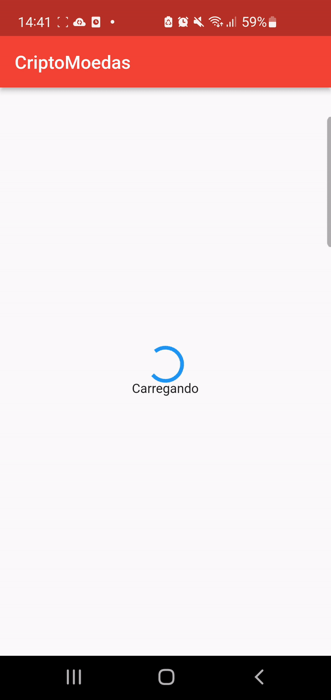

# Você chegou ao aplicativo de criptomoedas
Esse projeto foi desenvolvido com o intuito de demonstrar a utilização de api para criação de portifolio.

## Tela do projeto

  

## Principais tecnologias usadas

* [Dart](https://dart.dev/)
* [Flutter](https://docs.flutter.dev/)

## Pacotes utilizados

* [http](https://pub.dev/packages/http)
* [flutter_svg](https://pub.dev/packages/flutter_svg)

## API utilizada

* [Nomics](https://nomics.com/docs)

## Como rodar o projeto localmente

* Configure o flutter em sua maquina
* Faça o clone do repositório
* Rode o projeto em sua IDE de preferência
